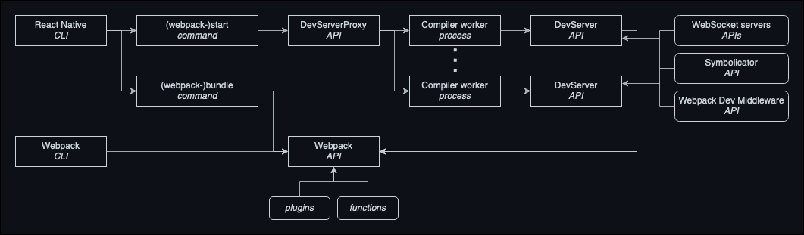

# Architecture

This document describes the high-level architecture of `@callstack/nativepack`.
If you want to familiarize yourself with the code base, you are just in the right place!

Before you start, make sure you've gone through the [README](./README.md).

Feel free to jump between this document and [API documentation](https://callstack-nativepack.netlify.app/)
for an additional context on configuration, parameters and types.

## General overview

There are 2 ways to look at the content of the `@callstack/nativepack`:

- by command that are exposed to React Native CLI
- by Webpack plugins and utilities

Here's a chart that represents both aspect of the codebase:



## Structure

The following list describes the components that create `@callstack/nativepack`:

- `public/` — Public assets for Debugger UI.
- `templates/` — Templates for files to initialize a new project.
- `react-native.config.js` — React Native CLI plugin file with commands declarations.
- `src/`
  - `client/` — Source code for Debugger UI.
  - `commands/` — Source code for React Native CLI commands.
  - `runtime/` — Source code for runtime code embedded into a final bundle.
  - `server/` — Source code for Development server, proxy and all related functionality.
  - `webpack/` — Source code for Webpack plugins and utilities.

## Bundling

The core of bundling functionality is to load platform-specific Webpack configuration file, then using Webpack API, create and run a compiler.

Depending on how code is run, the final Webpack configuration might be different, as the behavior of `parseCliOptions` differs.
Please refer to a [dedicated `parseCliOptions` section](#parseclioptions) for more information.

There's not much difference between in `(webpack-)bundle` command and Webpack CLI logic, except that `(webpack-)bundle` command
accepts React Native specific CLI options and Webpack CLI has its own set of options.

## Development server

When running a development server, there is a wide difference in the functionality provided by `(webpack-)start` command and Webpack CLI:

- Webpack CLI:
  - Will create platform-specific Webpack configuration, so when the compiler calls `DevSeverPlugin`, a platform-specific `DevServer` will be created.
  - The platform-specific `DevServer` has all the required features (debugging, symbolication, logging, message/events WebSocket server, HMR, Dev endpoints).
- `(webpack-)start`:
  - Uses `DevServerProxy`, which sole purpose is to allow running multiple Webpack compilers for multiple platforms.
  - Each platform will get its own _compiler worker_, which runs Webpack compiler in watch mode. For each compilation a platform-specific Webpack
  configuration will be created, which will include platform-specific `DevServer`.
  - Each platform-specific `DevServer` will listen on randomly picked free-port.
  - `DevServerProxy` will handle the creation of said workers, as well as forwarding the requests based on `?platform=<platform>` query param.
  - Additionally `DevServerProxy` has the same Dev endpoints as `DevServer` (they both extend `BaseDevServer`) and dedicated `POST /symbolicate` endpoint.

The overall architecture of `DevServerProxy` is as follows:
```
`DevServerProxy`
├── <compiler worker platform=ios>
│   └── <webpack compilation>
│       └── `DevServerPlugin`
│           └── `DevServer`
├── <compiler worker platform=android>
│   └── <webpack compilation>
│       └── `DevServerPlugin`
│           └── `DevServer`
└── ...
```

Check [`parseCliOptions` section](#parseclioptions) for details on configuration options that the `DevServer` or `DevServerProxy` will receive.

## `parseCliOptions`

To support the common use-case, which is to run `@callstack/nativepack` using
React Native CLI, we need to be able to pass CLI options passed to the command (eg: when running
`npx react-native webpack-start`) to the Webpack configuration. The problem is, that Webpack configuration
must be an object with all the required fields already filled in.

Based on that, the CLI options along with config object from React Native CLI is stored in a `process.env`
variable that `parseCliOptions` then reads when evaluating Webpack configuration code.

However, this `process.env` variable will not be set when running with Webpack CLI. To cover that case,
there's a `fallback` property in configuration object for `parseCliOptions`. If you run with Webpack CLI
all properties defined under `fallback` will be used in place of CLI options from React Native CLI.

Additionally in both cases, some properties are optional and will default to values defined in `DEFAULT_FALLBACK`
constant.

To summarize the whole `parseCliOptions` would perform the following actions:

1. Merge `DEFAULT_FALLBACK` with provided `fallback` values.
2. If CLI options in `process.env` are missing, return merged object from 1.
3. If CLI options are provided, and the command is `(webpack-)bundle`, return values based on CLI
   options (some fields might use values from merged object from 1.).
4. If CLI options are provided, and the command is `(webpack-)start`, return values from
   merged object from 1. and `devServer` configuration object based on the CLI options.

Please note that it's possible not to use `parseCliOptions` at all and hard code all the necessary
values directly into Webpack configuration file or read it from somewhere else (eg: custom `process.env` variables or a file).
  
## Logging

Depending on how you run `@callstack/nativepack` the logging works slightly differently, but
the end destination for all logs is `Reporter` instance — this is the place where all logs are
written to the terminal and/or file. The route that each log takes to get to the reporter instance
will differ.

The top-level `Reporter` instance will also try to broadcast logs to the connected Flipper instance
under _React Native_ -> _Logs_ with tag `rnwt_<type>` where `type` can be `debug`, `info`, `warn`
or `error`. Because of the Flipper tight integration with Metro all `@callstack/nativepack`
logs will be reported as `verbose` so make sure you sent the filter to include type `Verbose`
and use searching to filter logs e.g. by typing `rnwt_debug`.

### Bundling with `(webpack-)bundle` command and Webpack CLI / Running with development server via Webpack CLI

> Read as stack trace, from bottom to the top.

```
<terminal/file>
└── Reporter
    └── LoggerPlugin
        ├── <webpack stats>
        ├── compilation.hooks.log
        └── compiler.hooks.infrastructureLog
            └── DevServerPlugin
                └── DevServer
```

### Running with development server via `(webpack-)start` command

> Read as stack trace, from bottom to the top.

```
<terminal>
└── Reporter
    └── DevServerProxy
        └── <compiler worker>
            └── Reporter <file: if enabled> (format: json)
                └── LoggerPlugin
                    ├── <webpack stats>
                    ├── compilation.hooks.log
                    └── compiler.hooks.infrastructureLog
                        └── DevServerPlugin
                            └── DevServer
```