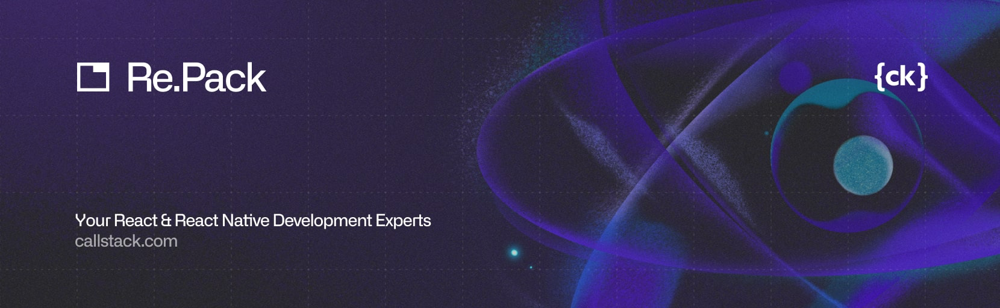

  

A toolkit to build your React Native application with Rspack or Webpack.

---

[![Chat][chat-badge]][chat]
[![PRs Welcome][prs-welcome-badge]][prs-welcome]
[![Sponsored by Callstack][callstack-badge]][callstack]

Re.Pack is a next generation of [Haul](https://github.com/callstack/haul) — a Webpack-based bundler for React Native applications.

Re.Pack uses Rspack (or Webpack 5) and React Native Community CLI's plugin system to allow you to bundle your application using Webpack and easily switch from Metro.

## Documentation

The documentation is available at [re-pack.dev](https://re-pack.dev).

You can also use the following links to jump to specific topics:

- [About Re.Pack](https://re-pack.dev/docs/about)
- [Getting Started](https://re-pack.dev/docs/getting-started)
- [Configuration](https://re-pack.dev/docs/configuration/webpack-config)
- [API documentation](https://re-pack.dev/api/about)
- [Known issues & limitations](https://re-pack.dev/docs/known-issues)
- [Code splitting](https://re-pack.dev/docs/code-splitting/concept)

## Made with ❤️ at Callstack

`@callstack/repack` is an open source project and will always remain free to use. If you think it's cool, please star it 🌟. [Callstack][callstack-readme-with-love] is a group of React and React Native geeks, contact us at [hello@callstack.com](mailto:hello@callstack.com) if you need any help with these or just want to say hi!

Like the project? ⚛️ [Join the team](https://callstack.com/careers/?utm_campaign=Senior_RN&utm_source=github&utm_medium=readme) who does amazing stuff for clients and drives React Native Open Source! 🔥

<!-- badges -->

[callstack-readme-with-love]: https://callstack.com/?utm_source=github.com&utm_medium=referral&utm_campaign=repack&utm_term=readme-with-love
[build-badge]: https://img.shields.io/github/actions/workflow/status/callstack/repack/test.yml?style=for-the-badge
[build]: https://github.com/callstack/repack/actions/workflows/test.yml
[version-badge]: https://img.shields.io/npm/v/@callstack/repack?style=for-the-badge
[version]: https://www.npmjs.com/package/@callstack/repack
[license-badge]: https://img.shields.io/npm/l/@callstack/repack?style=for-the-badge
[license]: https://github.com/callstack/repack/blob/master/LICENSE
[prs-welcome-badge]: https://img.shields.io/badge/PRs-welcome-brightgreen.svg?style=for-the-badge
[prs-welcome]: ./CONTRIBUTING.md
[chat-badge]: https://img.shields.io/discord/426714625279524876.svg?style=for-the-badge
[chat]: https://discord.gg/Q4yr2rTWYF
[callstack-badge]: https://callstack.com/images/callstack-badge.svg
[callstack]: https://callstack.com/open-source/?utm_source=github.com&utm_medium=referral&utm_campaign=repack&utm_term=readme-badge
