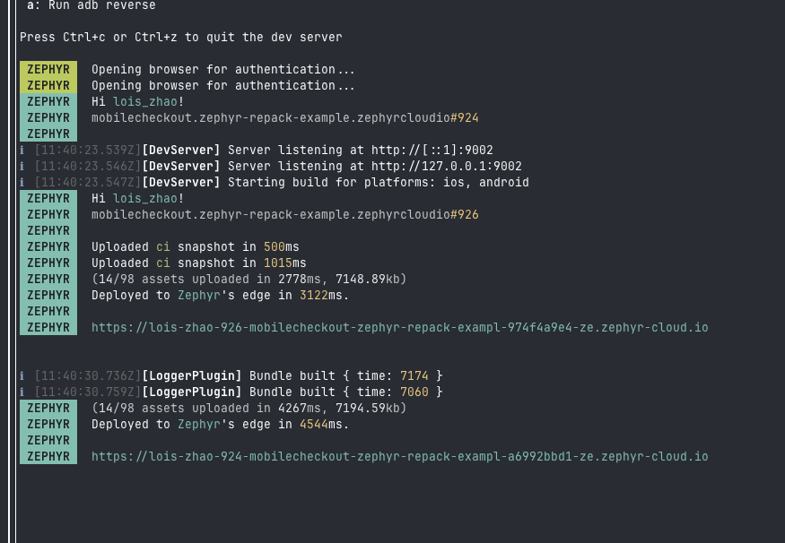
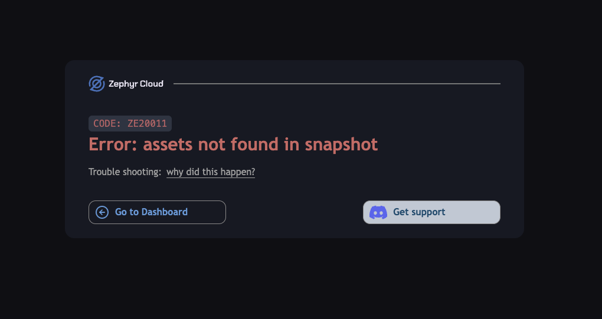

# Deployment 

Re.Pack supports deploying your React Native Applications with MiniApps to [Zephyr Cloud](https://zephyr-cloud.io) by `zephyr-repack-plugin` by adding one line of code in your build configuration file - whether you're using [Rspack](https://rspack.dev) or [webpack](https://webpack.js.org) - you can seemlessly integrate deployment into your workflow. 


Zephyr Cloud is an orchestration platform for instant deployment of Web and Cross-platform applications. You can bring your own cloud provider, or use Zephyr Cloud's hosted service. Read more about [supported cloud providers](https://docs.zephyr-cloud.io/cloud).

When you are using `zephyr-repack-plugin` with a React Native project with MiniApps, Zephyr automatically handles deploying and resolving to the correct remote application without modifying build configuration files (as in you can keep the `remoteEntry` as `MobileCart@https://localhost:8080/mf-manifest.json`).

## Prerequisites


1. We assume you have a React Native project with MiniApps ready. If not, you can follow the [Quick start guide](/getting-started/quick-start) from Repack docs or use the bootstrap CLI provided by Zephyr Cloud by running `create-zephyr-apps` and select `React Native` as the framework. 
```bash 
npx create-zephyr-apps@latest
```

2. A Zephyr Cloud account: sign up at [Zephyr Cloud](https://app.zephyr-cloud.io?ref=repack) if you haven't already. 
3. node >= 20 
4. ruby >= 3.2

:::info 

For more details related to `create-zephyr-apps` CLI, please refer to the [Zephyr Cloud's documentation for React Native, Re.Pack and Module Federation](https://docs.zephyr-cloud.io/recipes/repack-mf).

:::

## Deploy to Zephyr Cloud

When enabled, your MiniApps are deployed to Zephyr Cloud automatically whenever you build, or devevelopment server is running on your project. A deploy URL would be generated in your terminal as shown below: 



### Expected behavior 

If you click on the deploy URL, you will see this image: 



This is expected behavior as MiniApps on React Native doesn't have a default root `index.html` file. However, you can inspect whether any thing was deployed by adding the suffix `/mf-manifest.json` at the end of the URL to see if the manifest file exists (will be improved in the recent future). 

| URL | Manifest file |
| --- | --- |
| `https://<your-deploy-url>.com`| `https://<your-deploy-url>.com/mf-manifest.json` |


The deploy URL is instantly sharable, available and able to be used, or auto-resolved by Zephyr Cloud when have a MiniApp in your Host App. [Read more about deploying, managing federated application with Zephyr Cloud](https://docs.zephyr-cloud.io/how-to/mf-guide).


## Learn more about Zephyr Cloud

- [Website](https://zephyr-cloud.io)
- [Documentation](https://docs.zephyr-cloud.io)
- [Discord](https://zephyr-cloud.io/discord)
- [Twitter](https://zephyr-cloud.io/twitter)
- [YouTube](https://zephyr-cloud.io/youtube)


